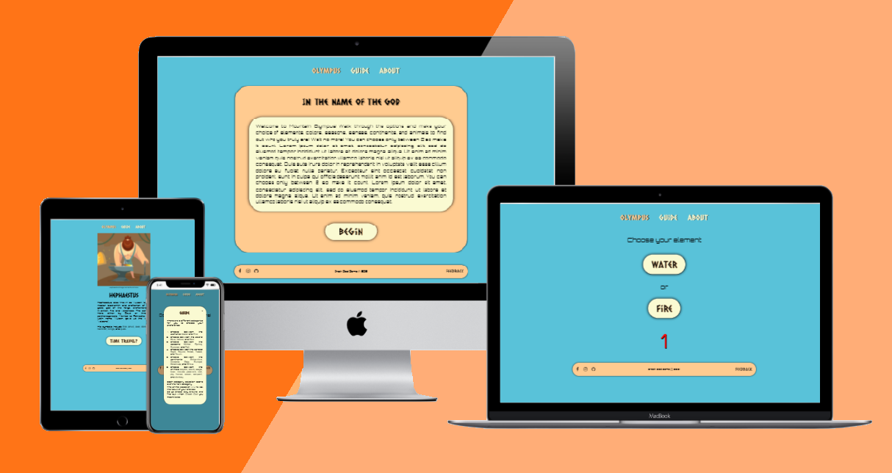
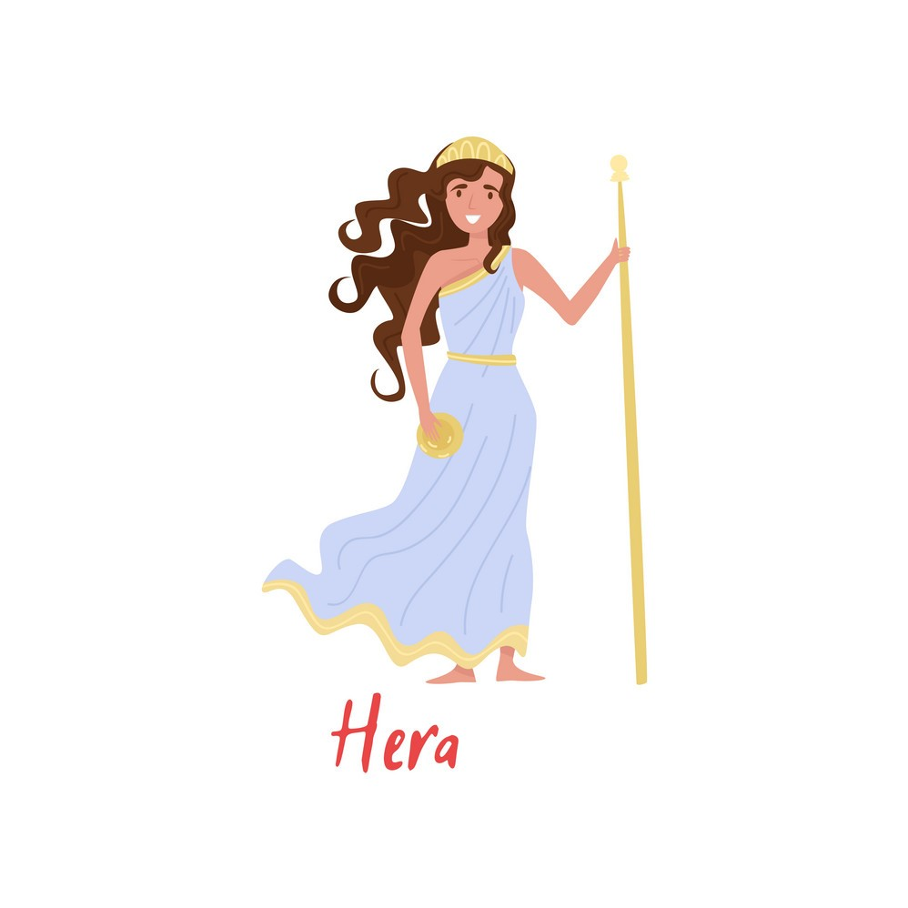
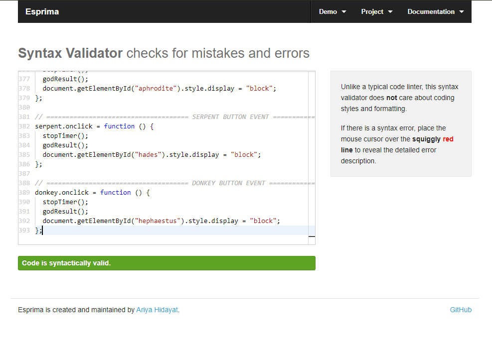

# Greek God Game 

View the live project [here](https://mariapapageorgiou.github.io/greek-god-game/)

## Table of contents
1. [About the "Greek God Game" Idea](#About-the-"Greek-God-Game"-Idea)
2. [Main Requirements](#Main-Requirements)
3. [UX (User Experience)](#UX-(User-Experience))
    1. [Ideal User](#Ideal-User)
    2. [User Stories](#User-Stories)
4. [Development Planes](#Development-Planes)
    1. [Strategy](#Strategy)
    2. [Scope](#Scope)
    3. [Structure](#Structure)
    4. [Skeleton](#Skeleton)
5. [Design](#Design)
    1. [Colour Scheme](#Colour-Scheme)
    2. [Typography](#Typography)
    3. [Images](#Images)
6. [Features](#Features)
    1. [Design Features](#Design-Features) 
    2. [Existing Features](#Existing-Features)
    3. [Back to the Feature (Features for the Future)](#Back-to-the-Feature-(Features-for-the-Future))
7. [Issues](#Issues)
8. [Technologies Used](#Technologies-Used)
     1. [Main Languages Used](#Main-Languages-Used)
     2. [Libraries, Programs, and Resources](#Libraries,-Programs,-and-Resources)
9. [Testing](#Testing)
10. [Deployment](#Deployment)
11. [Credits](#Credits)
12. [Acknowledgements](#Acknowledgements)
***

## About the "Greek God Game" Idea

The Greek God Game idea was inspired from my greek heritage and love of history and greek mythology. The purpose of the website is to entertain online users and gamers while providing basic information about the 12 greek gods.

I decided to include Poseidon, Hermes, Zeus, Ares, Apollo, Hera, Athena, Demeter, Artemis, Aphrodite, Hades, and Hephaestus as the 12 gods (there are 2 more that can be included, Hestia and Dionysus).

This is the second of five Portfolio Projects that must be completed in order to obtain the Diploma in Software Development (E-commerce Applications) from Code Institute. 

[Back to top ⇧](#Greek-God-Game)

## Main Requirements

The main requirements for the Project Portfolio 2:
- Design an interactive Front-End web application using HTML and CSS and JavaScript based on the principles of user experience design, accessibility and responsivity
- Test a front-end web application through the development, implementation and deployment stages
- Deploy a Front-End web application to a Cloud platform
- Maximise future maintainability through documentation, code structure and organisation
- Demonstrate and document the development process through a version control system such as GitHub
- Implement Front-End interactivity, using core JavaScript, JavaScript libraries or frameworks

[Back to top ⇧](#Greek-God-Game)

## UX (User Experience)

### Ideal User
- Gamers
- Greek mythology fans

### User Stories
- New Users
     1. I want to navigate through the application to find the relevant information, effortlessly. 
     2. I want to make the selections and find out about the result
     3. I want to find out how to play the game

- Current Users:
     1. I want to find out about new content on the page.
     2. I want to see any updates or additions to the game.
     3. I want to leave feedback .

[Back to top ⇧](#Greek-God-Game)

## Development Planes

### Strategy

Identifying the target audience:
- Fans of online games
- Fans of the greek mythology

The application needs to allow the **user** to:
- Have a great gaming experience
- Educate about greek mythology
- Provide feedback through a form modal

### Scope
In order to accompish the strategy goals, a scope was developed with the followig **Content Requirements**:
- Guide section
- Greek Mythology Information
- God Images
- Feedback form
- Social Links

### Structure
The **hierarchial tree structure** information architecture type was chosen in order to ensure that users will navigate through the site efficiently.

### Skeleton 
The Wireframe mockups were created with a [Figma Workspace](https://www.figma.com/file/PannW7EfxQAHOObt2LzuTc/Greek-God-Game?node-id=2%3A3)

Home Page:

Choices Page:

[Back to top ⇧](#Greek-God-Game)

## Design

### Colour Scheme
The main colours used throughout the website are a blue, off white, black, and light rose gold.

### Typography
The two fonts chosen were:
- [Caesar Dressing](https://fonts.google.com/specimen/Caesar+Dressing "Link to Josefin Slab Google Font") is used for the body, with cursive as the fallback font in case of import failure.
- [Orbiton](https://fonts.google.com/specimen/Orbitron "Link to Great Vibes Google Font") is used in the all paragraphs of the website, with sans-serif as the fallback font in case of import failure. 

### Images
After thorough research of appropriate images the following made the final cut:

- Poseidon Image:

Photo can be found [here](https://www.freepik.com/free-vector/ancient-greek-god-poseidon-illustration_6207102.htm "Link to Poseidon Image origin")

- Hermes Image:

Photo can be found [here](https://www.freepik.com/premium-vector/hermes-greek-god-trade-illustration_4843863.htm "Link to Hermes Image origin")

- Zeus Image:

Photo can be found [here](https://www.freepik.com/free-vector/greece-ancient-gods-flat-cartoon-powerful-mythological-zeus-prominent-figure-pantheon_6845835.htm "Link to Zeus Image origin")

- Ares Image:

Photo can be found [here](https://www.freepik.com/premium-vector/greek-god-war-leading-angry-army-ancient-armored-warriors_14625490.htm#query=ares&position=1 "Link to Ares Image origin")

- Apollo Image

Photo can be found [here](https://www.vectorstock.com/royalty-free-vector/apollo-god-music-vector-29219851 "Link to Apollo Image origin")

- Hera Image:

Photo can be found [here](https://www.vectorstock.com/royalty-free-vector/hera-olympian-greek-goddes-ancient-greece-myths-vector-22000917 "Link to Hera Image origin")

- Athena Image:

Photo can be found [here](https://www.freepik.com/premium-vector/illustration-athena-goddess-victorious-war_4297198.htm "Link to Athena Image origin")

- Demeter Image:

Photo can be found [here](https://www.freepik.com/free-vector/demeter-cartoon-composition-with-elegant-figurine-greek-goddess-standing-ancient-architecture-background-flat-illustration_6869903.htm "Link to Demeter Image origin")

- Artemis Image: 

Photo can be found [here](https://www.freepik.com/free-vector/greek-goddess-flat-composition-with-cartoon-characters-artemis-holding-bow-group-animals-illustration_6869901.htm "Link to Artemis Image origin")

- Aphrodite Image:

Photo can be found [here](https://www.freepik.com/premium-vector/greek-goddess-beauty-love-aphrodite-myths_5662148.htm "Link to Aphrodite Image origin")

- Hades Image:

Photo can be found [here](https://www.freepik.com/free-vector/ancient-greek-underworld-god-king-dead-hades-flat-cartoon-composition-with-three-headed-dog_6845837.htm "Link to Hades Image origin")

- Hephaestus Image:

Photo can be found [here](https://www.freepik.com/free-vector/greek-god-hephaestus-forging-iron-his-anvil_14625487.htm "Link to Hephaestus Image origin")

[Back to top ⇧](#Greek-God-Game)

## Features

### Design Features

1. The **Header** contains a cosistent and responsive **navigation bar** in the top of all pages.

2. The **Footer** contains the **social media icons**, in the bottom left of all pages, the **copyrights** in the bottom middle of all pages, and the **feedback** on the bottom right of all pages.

3. The **Home** page is divided into two sections:
     - Welcome Text
     - Guide Modal (hidden)

4. The **Choices** page is divided into four sections:
     - The choice selections
     - The end result (hidden)
     - The restart message (hidden)
     - Guide Modal (hidden)

5. The **About** page is divided into three sections:
     - About text (under construction)
     - Guide Modal (hidden)

### Existing Features

- **Header Navigation Bar** - Appears in every page and is positioned at a fixed place in order to ensure easy and effortless access to the navigational system.
- **Action buttons** - Appear in the home page, footer, about page, and choices page. In the event of the buttons being active, the user will be redirected to internal and external sites such as:
     - Choises page
     - Color category choice
     - Season category choice
     - Sense category choice
     - Continent category choice
     - Animal category choice
     - Final God result
     - Restart the game
     - About page
     - Social media links
     - Guide Modal
     - Feedback Modal (under construction)

- **Social Media Icons** - Appear in every page. The icons depicts the various social media platforms, when hovered over they turn into the official colors of the coresponding social media platform.

### Back to the Feature (Features for the Future)

- **Feedback Modal** - Provide feedback for the experience and get a positive thank you message
- **About Page** - Provide information about the creation of the game and helpful links
- **404 Error Page** - Create a 404 error page to redirect the user back to safety

[Back to top ⇧](#Greek-God-Game)

## Issues 

During the development process, the following issues were successfully corrected:

**Timer Function** 
- While developing the timer functionality, there were a few issues. Material was found and incorporated from [Codepen](https://codepen.io/joshua-golub/pen/LYYKrKg "Link to CodePen solution") and [freeCodeCamp](https://www.freecodecamp.org/news/how-to-create-a-countdown-timer/ "Link to freeCodeCamp solution")
- The restart message was shown while the final result was shown. For the stop functionality to work properly and hide the elements required, Michael from tutor assistance was able to assist with the bug.

**Footer**
- After different positiong, use of margins, height, and padding, and no use of Bootstrap, the footer is not properly positioned at the end of each screen size as expected.
[Back to top ⇧](#Greek-God-Game)

## Technologies
### Main Languages
- [HTML5](https://en.wikipedia.org/wiki/HTML5 "Link to HTML Wiki")
- [CSS3](https://en.wikipedia.org/wiki/Cascading_Style_Sheets "Link to CSS Wiki")
- [JavaScript](https://en.wikipedia.org/wiki/JavaScript "Link to JavaScript Wiki")

### Libraries, Programs, and Resources
- [Figma](https://www.figma.com/ "Link to Figma homepage")
     - Figma was used to create the wireframes during the Skeleton Plane of User Experience.
- [Google Fonts](https://fonts.google.com/ "Link to Google Fonts")
    - Google fonts were used to import the fonts "Great Vibes", "Playfair Display", and "Josefin Slab".
- [Font Awesome](https://fontawesome.com/ "Link to FontAwesome")
     - Font Awesome was used to import the social media icons.
- [Git](https://git-scm.com/ "Link to Git homepage")
     - For version control, Git was used through the GitPod terminal.
- [GitHub](https://github.com/ "Link to GitHub")
     - GitHub was used to create a repository for the project.
- [W3Schools](https://www.w3schools.com/ "Link to W3Schools Page")
     - W3Schools was used to gather information and methodology for the project
- [Stack Overflow](https://stackoverflow.com/ "Link to Stack Overflow page")
     - Stack Overflow was used to gather information and methodology about the time functionality for the project

[Back to top ⇧](#Greek-God-Game)

## Testing

All [User Stories](#User-Stories) were manually tested and successfully passed all responsive tests.

Code Validation:

1. The [W3C Markup Validator](https://validator.w3.org/) website was used to validate the `HTML` pages.

    - Home Page

         

    - Choices Page

         

    - About Page

         

2. The [W3C CSS Validator](https://jigsaw.w3.org/css-validator/) website was used to validate the `CSS` code.

3. The [Esprima: Syntax Validator](https://esprima.org/demo/validate.html) website  was used to validate the `JavaScript` code.

4. The [Lighthouse Google Extention](https://developers.google.com/web/tools/lighthouse) was used to create a report for the live website.

## Deployment

The Greek God Game Portfolio Project 2 was developed using [Gitpod](https://gitpod.io/ "Link to Gitpod")
Git was used for all commits.
Through Git the project was pushed to GitHub using the computer terminal.
Gitpod's terminal was used for all commit and push commands. 
The project was deployed using GitHub Pages.

[Back to top ⇧](#Greek-God-Game)

## Credits 

### Content

- The content for the 12 gods was found through wikipedia [here](https://en.wikipedia.org/wiki/Twelve_Olympians "Link to Twelve Olympians")
- The code used to implement timer functionality was found from [Codepen](https://codepen.io/joshua-golub/pen/LYYKrKg "Link to CodePen solution") and [freeCodeCamp](https://www.freecodecamp.org/news/how-to-create-a-countdown-timer/ "Link to freeCodeCamp solution")
- All images originate from [Vectorstock](https://www.vectorstock.com/ "Link to Vectorstock site") and [freepic](https://www.freepik.com/ "Link to freepik site")

[Back to top ⇧](#Greek-God-Game)

## Acknowledgements

- I would like to thank my wife, children, family, and friends for their support and valued critic during the project development.
- I would like to thank my mentor, Seun, for her guidance throughout the process.
- I would like to thank my tutor, Michael, for helping (twice) again during dawn hours!
- Special thanks to my friend Alex who inspired me to make this project.

[Back to top ⇧](#Greek-God-Game)